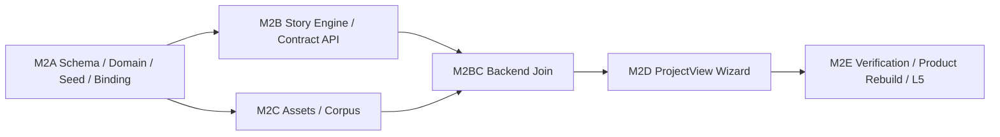

# M2 Creation Contract and Assets Implementation Index

> **For agentic workers:** REQUIRED SUB-SKILL: Use superpowers:subagent-driven-development (recommended) or superpowers:executing-plans to implement this plan task-by-task. Steps use checkbox (`- [ ]`) syntax for tracking.

**Goal:** 按可独立审查的交付包实现 `writer-core-v1.1.0` 创作契约、故事发动机、全局创作资产、本机语料和正式五步向导，并完成一次真实 Provider/产品库验收。

**Architecture:** 先建立不可变 Schema 和领域协议，再并行实现 Provider/契约服务与资产/语料服务；随后把两条后端能力接入真实 ProjectView，最后才进入 Disposable MySQL、真实浏览器、产品库重建和单次 L5 Provider 验收。每个交付包有独立测试和提交边界，旧 AI proxy、浏览器 adapter、localStorage 正式状态及 phase-e runner 不进入新链路。

**Tech Stack:** Python 3.12、FastAPI、Pydantic、aiomysql、MySQL 8.4、httpx、Vue 3、Pinia、Naive UI、Node `node:test`、Playwright。

---

## Dependency graph



M2A 必须单独完成。M2B 与 M2C 的领域、服务和测试可以在独立任务分支并行开发；它们对 `backend/main.py`、route inventory 和聚合入口的最终注册提交必须顺序合并并复测。M2D 只在两者接口冻结后开始。M2E 不实现业务能力，只收束测试入口、显式产品库重建和验收证据。

## Plans

1. `docs/superpowers/plans/2026-07-11-m2a-schema-domain-and-bindings.md`
2. `docs/superpowers/plans/2026-07-11-m2b-story-engine-and-contract-service.md`
3. `docs/superpowers/plans/2026-07-11-m2c-assets-and-corpus.md`
4. `docs/superpowers/plans/2026-07-11-m2d-creation-contract-wizard.md`
5. `docs/superpowers/plans/2026-07-11-m2e-verification-and-live-acceptance.md`

After M2A is reviewed, create `codex/m2b-story-engine-contract` and `codex/m2c-assets-corpus` from the same recorded M2A commit using isolated worktrees. No agent works directly in the controller worktree.

### Task 1: Join the reviewed M2B and M2C backend branches

**Files:**
- Modify: `backend/main.py`
- Modify: `backend/tests/api/test_route_inventory.py`
- Modify: `backend/tests/api/test_product_routes.py`

- [ ] **Step 1: Merge M2B first, then M2C, without resolving conflicts by dropping either branch's tests**

```powershell
git merge --no-ff codex/m2b-story-engine-contract
git merge --no-ff codex/m2c-assets-corpus
```

Use these fixed branch names when dispatching M2B/M2C so the join command is reproducible.

- [ ] **Step 2: Register the complete approved router set and safe SPA helper**

`backend/main.py` imports and mounts seeds, model_bindings, story_engines, contracts, assets, corpus, projects, providers and canon. It continues to exclude old `ai_proxy`, market, experience_cards, planning, drafts, Writer and finalization routers. Replace direct `FRONTEND_DIST / path` serving with M2C's decoded containment helper.

- [ ] **Step 3: Update the single global route inventory**

Assert every frozen M2 method/path from M2A/M2B/M2C is present and every forbidden legacy prefix remains absent. Update `test_product_routes.py` to assert public behavior through dependency-injected services rather than monkeypatching old router-level SQL helpers.

- [ ] **Step 4: Run the joined API and retained M1 behavior tests**

```powershell
python -m pytest backend/tests/api -q
python -m pytest backend/tests/unit/test_main_lifespan.py backend/tests/unit/test_no_runtime_ddl.py -q
```

Expected: all exit 0; startup performs schema verification only; SPA traversal is rejected; no Provider or DB write occurs.

- [ ] **Step 5: Commit the join and record its hash for M2D**

```powershell
git add backend/main.py backend/tests/api/test_route_inventory.py backend/tests/api/test_product_routes.py
git commit -m "feat: join M2 backend routes"
git rev-parse HEAD
```

## Shared execution rules

- [ ] Start execution from the clean commit containing this index and all five approved plans on `codex/writer-core-v1`; record its hash before creating an isolated implementation worktree.
- [ ] Set `$env:APPROVED_M2_PLAN_COMMIT = git rev-parse HEAD` at that clean plan commit and pass the exact value to every execution task; artifact gates fail closed when it is absent.
- [ ] Use TDD for every behavior change: focused RED, minimal GREEN, focused regression, then commit.
- [ ] Never run Provider calls or product DB writes in M2A–M2D.
- [ ] Run MySQL tests only with explicit `TEST_MYSQL_*`; every database name must match `novel_creator_test_[a-f0-9]{32}`.
- [ ] Before the first integration/browser task, verify all four `TEST_MYSQL_HOST/PORT/USER/PASSWORD` values are privately configured. Their absence must stop the suite with usage error; it never authorizes fallback to product `.env.local.json`.
- [ ] Every isolated worktree owns its own ignored `.venv-m2`; venv directories are never shared or assumed to follow the branch. On first use in each M2B/M2C/M2D/M2E worktree, if `.venv-m2` is absent run `py -3.12 -m venv .venv-m2`, install `pip==25.0.1`, install `backend/requirements-m2.lock.txt`, run `pip check`, then activate it. Every Python command must resolve to that worktree's `.venv-m2\Scripts\python.exe`; never fall back to machine-global Python as M2 evidence.
- [ ] Every frontend-using M2D/M2E worktree owns its own ignored `frontend/node_modules`. Require `node --version` = `v24.13.0` and `npm --version` = `11.6.2`, run `npm --prefix frontend ci`, set `$env:PLAYWRIGHT_BROWSERS_PATH='0'`, then run `npm --prefix frontend exec playwright install chromium` and verify Playwright `1.61.1`. Run every later browser command with the same `PLAYWRIGHT_BROWSERS_PATH=0`; never rely on the controller worktree's node_modules or an unrelated global browser cache.
- [ ] Browser tests must click/type through the formal UI; forbid `page.request`, direct `fetch`, route fulfillment and API write helpers.
- [ ] Preserve M1 evidence as immutable history. M2 adds v1.1 behavior regressions instead of rewriting M1 reports or requiring old exact schema/route gates to pass unchanged.
- [ ] Do not restore `backend/routers/ai_proxy.py`, `backend/routers/experience_cards.py`, `frontend/src/data/experienceCardProduct.js`, `frontend/src/views/ExperienceCardsView.vue`, old Writer stores, phase-e runners or `tmp` artifacts.
- [ ] Public API/log/browser payload scans compare every nested string against stored secret/base URL/path sentinels, not only forbidden field names.
- [ ] Commit after each independently green task. The v1.1 Schema and its reset/bootstrap callers are one explicit atomic exception because either half alone leaves the branch broken. Do not otherwise combine Provider, asset content, UI and product-data changes in one commit.

## Cross-plan checkpoints

- [ ] **Checkpoint A:** M2A unit/API tests and Disposable MySQL fresh bootstrap pass before M2B/M2C merge.
- [ ] **Checkpoint B:** M2B fake transport tests prove one outbound attempt, unknown-outcome handling and atomic contract confirmation; no real Provider call.
- [ ] **Checkpoint C:** M2C asset manifest is reviewed by the user/product controller before seeding; at least one authorized real `.txt` is imported only at the explicit L4 checkpoint.
- [ ] **Checkpoint D:** M2D fixed browser tests pass against a disposable DB with synthetic Provider fixtures before product DB rebuild.
- [ ] **Checkpoint E:** All non-live tests pass, diffs are reviewed, and the user sees the exact destructive target before the product DB rebuild command is executed.
- [ ] **Checkpoint L5:** From the formal ProjectView, make one controlled `联通云 / deepseek-v4-flash` story-engine request for `典镇山河`, choose one option, confirm revision 1, reload, and reconcile UI/DB batch ID, revision and hashes.

## Spec coverage map

| Approved specification area | Implemented and verified by |
|---|---|
| Scope, five-step formal flow, M2/M3 boundary | M2D Tasks 1–4; M2E Tasks 3 and 8 |
| Schema v1.1, seed revisions, heads, specialized refs | M2A Tasks 1–3 |
| Eight-task binding revisions, inheritance, unbound/ready, Provider soft-delete | M2A Task 5; M2E Tasks 3 and 7 |
| Manual/Provider three-engine batches, idempotency, one attempt, reconcile | M2B Tasks 1–3; M2E Tasks 3 and 8 |
| Recoverable draft, deterministic preview, append-only atomic confirmation | M2B Tasks 4–5; M2D Tasks 2–3 |
| Eight reviewed styles and 40–60 reviewed experience cards | M2C Tasks 1–3; M2E Task 6 |
| Corpus root, encodings, hashes, boundaries, fragments, containment | M2C Tasks 4–6; M2E Tasks 3, 6 and 7 |
| No secrets/base URL/DSN/absolute path/full novel in public surfaces | M2A Task 5; M2B Task 3; M2C Tasks 4 and 6; M2E Tasks 1–8 |
| L1–L5 evidence hierarchy, no shadow QA, real UI entry | M2E Tasks 1–8 |
| Explicit product rebuild, asset seed, real source, one DeepSeek acceptance | M2E Tasks 7–8 |
| Canon/Projection remain 0; no planning/draft/final placeholders | M2A Tasks 2–3; M2E Tasks 4, 7 and 8 |

## Completion label

Only after every plan and checkpoint passes may the branch claim **L5 M2 Contract-Generation Ready**. This label does not claim rolling planning, Writer, chapter generation, prose quality, finalization or full Product Ready.
